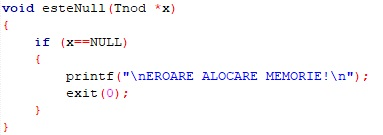

**[EN]**  

=======================================================================        
##Quick info  
=======================================================================       
PROJECT NAME: Online Shopping Bag

AUTHOR: Andreea-Denisa Asavoaei

DATE: started - 03/15/2018  
	  completed - 05/25/2018

PURPOSE: algorithms and data structures utilization to build a simulating application

DATA STRUCTURES USED: simply linked lists, max-heap

DESCRIPTION: this program uses simply linked lists to store the products that the user wants to buy; it also uses max heap to find de maximum payment the user has done with his orders

PROGRAMMING LANGUAGE USED: C

=======================================================================  
##Program menu with functions and descriptions  
=======================================================================    
1. **Initialize the shopping bag**    
_create the simply linked list and initialize the first and the last element with NULL_  
2. **Show a table with the available products to buy**    
_read which of the product tables to be displayed(1 for women and 2 for men)_  
3. **Add a product in the shopping bag**    
_add a node in the simply linked list containing the code, name and price of product if it doesn't already exist in list; if it does exist, it will ask the user if he wants to modify the quantity of the product and if the answer is positive, it will read the new quantity and it will modify it within the list_  
4. **Remove a product from the shopping bag**  
_search for the node with the given code in the list; if it is found, it will remove the pointer to the next node and free the actual node_  
5. **Display the products added in the shopping bag**    
_go through the simply linked list and display the code, the name, the price and the current quantity of each product_  
6. **Read the contact, shipping and payment informations**    
7. **Show the order summary**  
_display the informations read at the 6th point, the whole products within the shopping bag at that moment and also the total payment_  
_store the total payment in an array that will be used at 10th point_  
8. **Empty the shopping bag**    
_go through the simply linked list and remove each node_  
9. **Process the order**    
_idem 8th_  
10. **Display the maximum amount paid with max-heap**    
_create a max-heap that will store within its nodes the values added in the array from 7th point and go through the heap so it will check if it satisfies the property:_  
> if P is a parent node of C, then the key(value) of P is either greater than or equal to the key of C.  
  
_if it doesn't satisfies the property, the function will call a swap function to switch the values from the nodes so it will satisfy the property in the end_  
11. **Close the program**    
_call exit(1) function to stop the execution of program_  

=======================================================================      
##User guide  
=======================================================================    
To access one of the functions described in _Program menu with functions and descriptions_, you will have to enter a value from 1 to 11 depending on what you want to do. The normal order to access the functions from the menu is the listed order with some exceptions(the optional ones).  
If you don't pass a value from [1,11], the output will be an error message and the program will ask for another number.  
=======================================================================   
##Algorithms and data declarations for each data structure(with images)  
=======================================================================    
1. Simply Linked List
Node structure declaration  
  
List structure declaration  
  
List initialization function  
  
Check if a node is null function  
  
Search for a node within the list with a given name    
  
Insert a node in list  
  
  
  
Remove a node from list  
  
Calculate the price in relation with the quantity of the product  
  
Show the products added in list  
  
Remove the whole list and free the memory  
  
2. Maximum Heap  
Insert the values from the array in heap  
  
Swap values in heap if they don't check the property described    
 

=======================================================================  

**[RO]**  

=======================================================================    
##Informaţii scurte  
=======================================================================    
DENUMIRE PROIECT: Cos de cumparaturi online  

AUTOR: Andreea-Denisa Asavoaei  

DATĂ: început în - 15/03/2018  
	  finalizat în - 25/05/2018  

SCOP: utilizarea algoritmilor şi a structurilor de date pentru a construi o aplicaţie de simulare  

STRUCTURI DE DATE UTILIZATE: liste simplu înlănţuite, max-heap  

DESCRIERE: acest program foloseşte liste simplu înlănţuite pentru a stoca produse pe care utilizatorul doreşte să le comande; de asemenea, utilizează max-heap pentru a afla suma maximă plătită la comenzile efectuate de utilizator  

LIMBAJUL DE PROGRAMARE FOLOSIT: C  

=======================================================================    
##Meniul programului cu funcţii şi descrieri
=======================================================================  
1. **Iniţializează coşul de cumpărături**  
_creează o listă simplu înlănţuită şi iniţializează primul şi ultimul element cu NULL_  
2. **Afişează lista cu produse disponibile**
_citeşte care dintre tabele să fie afişat(1 pentru femei şi 2 pentru bărbaţi) şi îl afişează_  
3. **Adaugă produs în coş**  
_adaugă un nod in lista simplu înlănţuită ce conţine codul, numele şi preţul produsului dacă acesta nu este găsit deja în listă; dacă există, utilizatorul va fi întrebat dacă doreşte să modifice cantitatea produsului şi dacă răspunsul este unul pozitiv, atunci programul va solicita şi citi cantitatea introdusă de utilizator, iar apoi o va modifica în consecinţă_  
4. **Şterge produs din coş**  
_caută nodul cu codul dat în listă; dacă este găsit, elimină pointerul către nodul următor şi eliberează nodul curent_  
5. **Afişează produsele adăugate în coş**  
_parcurge lista simplu înlănţuită şi afişează codul, numele, preţul şi cantitatea curentă a fiecărui produs_  
_add a node in the simply linked list containing the code, name and price of product if it doesn't already exist in list; if it does exist, it will ask the user if he wants to modify the quantity of the product and if the answer is positive, it will read the new quantity and it will modify it within the list_  
6. **Introdu datele de contact şi preferinţele pentru livrare/plată**  
7. **Afişează sumarul comenzii**  
_afişează informaţiile citite la punctul 6, toate produsele adăugate în listă până în momentul actual şi suma totală de plată_  
_stochează suma totală de plată într-un tablou care va fi folosit la punctul 10_  
8. **Goleşte coşul de cumpărături**  
_parcurge lista simplu înlănţuită şi elimină fiecare nod_  
9. **Procesează comanda**  
_idem punctul 8_  
10. **Afişează suma maximă plătită la comenzile plasate**  
_creează un max-heap care va conţine valorile adăugate în tabloul de la punctul 7 şi parcurge heap-ul pentru a verifica dacă satisface proprietatea:_  
> dacă P este un nod tată al lui C, atunci cheia(valoarea) lui P este mai mare sau egală cu cheia lui C. 

_dacă nu satisface proprietatea, va fi apelată funcţia de swap pentru a interschimba valorile nodurilor astfel încât să satisfacă această proprietate_  
11. **Închide aplicaţia**  
_apelează funcţia exit(1) pentru a opri execuţia programului_  

=======================================================================
##Ghidul utilizatorului  
=======================================================================  
Pentru a accesa una dintre funcţiile descrise în _Meniul programului cu funcţii şi descrieri_, va trebui să introduceţi o valoare de la 1 la 11 în funcţie de ceea ce doriţi să faceţi. Ordinea normală a accesării funcţiilor din meniu este cea enumerată cu anumite excepţii(funcţiile optionale).  
Dacă nu introduceţi o valoare din intervalul [1,11], va fi afişat un mesaj de eroare şi programul va solicita introducerea unei alte valori valide.  

=======================================================================   
##Algoritmi şi declarări de date pentru fiecare structură(cu imagini)  
=======================================================================   
1. Listă simplu înlănţuită
Declararea nodului   
  
Declararea listei  
  
Iniţializează lista   
  
Verifică dacă un nod este null  
  
Caută un nod în listă dupa nume     
  
Adaugă un nod în listă   
  
  
  
Elimină un nod din listă  
 
Calculează preţul în funcţie de cantitatea produsului    
  
Afişează produsele adăugate în listă  
 
Şterge toate nodurile şi eliberează memoria  
  
2. Maximum Heap  
Adaugă valorile din tablou în heap   
  
Interschimbă valorile din heap dacă nu verifică proprietatea descrisă anterior  
 